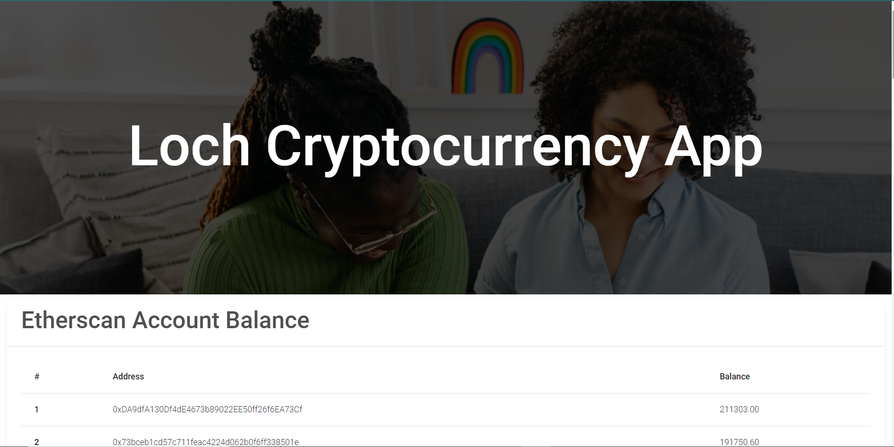

## About this app

This is a cryptocurrency aggregate API that fetches crypto data from public APIs such as Etherscan, Solscan & Alchemy which includes wallet balances and transactions by each wallet address.

 

## Preview Demo
[Loch Cryptocurrency Demo](https://localhost:3000) 

## Recommendation
My final recommendation in terms of aggregate of low latency, high quality, and ease of use include;

1. Etherscan is the most straightforward & simple with low latency, high quality and easier to use api
2. Solscan is also easier to use as it provides a clear API documentation to follow
3. Alchemy is great too most especially with the provision for their npm library and sample codes for most popular AJAX APIs like fetch and axios
4. Coingecko is more of an aggregate of the blockchain space where you can find info about different exchanges and tokens. I did not implement it in this project because it doesn't suit our problem here. Having gone through their documentation, i can say it might be easier to use too.
5. Blockchain wasn't used in this context as their mode of obtaining API key is tedious but i can say it could be easier to implement based on their documentation.

## Methodoly Adopted
The methodology used in this project is Rapid application development (RAD). This is used because this project provides a well-defined business objective. It allows you to adjust quickly to shifting requirements as such it's cost effective 

The rapid application development method contains four phases: requirements planning, user design, construction, and cutover. The user design and construction phases repeat until the user confirms that the product meets all requirements.

In this project, requirements where gathered, design made and development followed interatively until the needed features were implemented.

This project requires several wallet addresses to be obtained balances and transactions occured on those addresses. As such, it will be costly to loop through each address and obtain it's data from different API sources. This is where asynchronous and Promise API comes in. Since the API calls are costly make, requests  are made in parallel rather than looping through each wallet address to get its data. This does not only improve the performance of the app but it reduced the cost of making API calls. Since multiple addresses are sent to obtain their balance and transaction details, a promise of all the requests are generated and fetched in parallel until all the requests are resolved at once. This results in a low latency requests and highly performing software. The implementation of this can be found in the `api` directory of this project. 

Note: The data displayed in the UI of this app is just peripheral of the actual data. It can be extended to suit any need.

## Tools used
- Next.js (React js) makes easier to build high performing software app with great SEO while having modern features. It offers static generation and server-side rendering which is evident in this app. It's a framework that provides both server-side and client side functionalities.
- swr library for making client requests. It provides solution for depublication and easier to implement.
- Mdb-react-ui-kit which is a prebuilt react component for building user-interfaces.
- Etherscan API
- Solscan API
- Alchemy
- Javascript
## More About this project 

This is a [Next.js](https://nextjs.org/) project bootstrapped with [`create-next-app`](https://github.com/vercel/next.js/tree/canary/packages/create-next-app).

## Getting Started

First, run the development server:

```bash
npm install

npm run dev
# or
yarn dev
```

Open [http://localhost:3000](http://localhost:3000) with your browser to see the result.


You can start editing the page by modifying `pages/index.js`. The page auto-updates as you edit the file.

[API routes](https://nextjs.org/docs/api-routes/introduction) can be accessed on [http://localhost:3000/api/hello](http://localhost:3000/api/hello). This endpoint can be edited in `pages/api/hello.js`.

The `pages/api` directory is mapped to `/api/*`. Files in this directory are treated as [API routes](https://nextjs.org/docs/api-routes/introduction) instead of React pages.

## Learn More

To learn more about Next.js, take a look at the following resources:

- [Next.js Documentation](https://nextjs.org/docs) - learn about Next.js features and API.
- [Learn Next.js](https://nextjs.org/learn) - an interactive Next.js tutorial.

You can check out [the Next.js GitHub repository](https://github.com/vercel/next.js/) - your feedback and contributions are welcome!

## Deploy on Vercel

The easiest way to deploy your Next.js app is to use the [Vercel Platform](https://vercel.com/new?utm_medium=default-template&filter=next.js&utm_source=create-next-app&utm_campaign=create-next-app-readme) from the creators of Next.js.

Check out our [Next.js deployment documentation](https://nextjs.org/docs/deployment) for more details.
